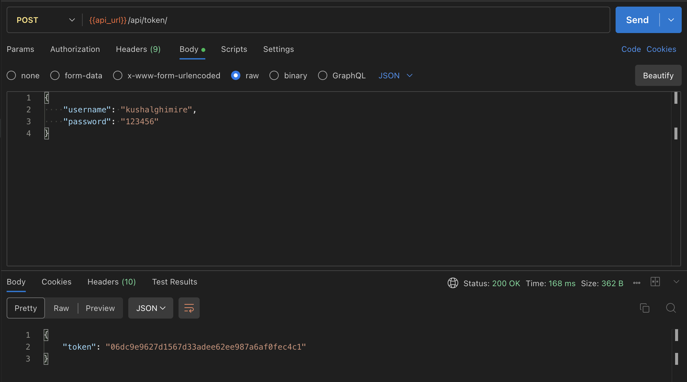
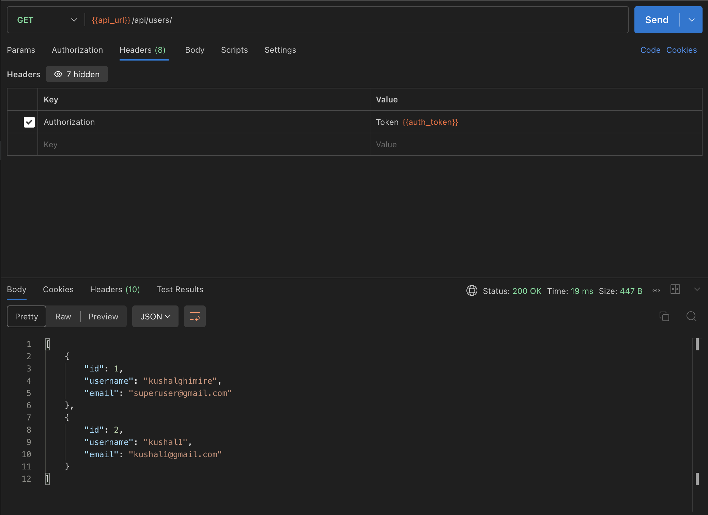
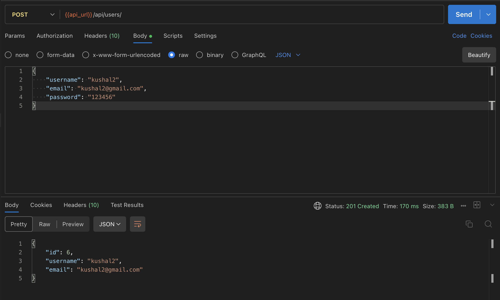
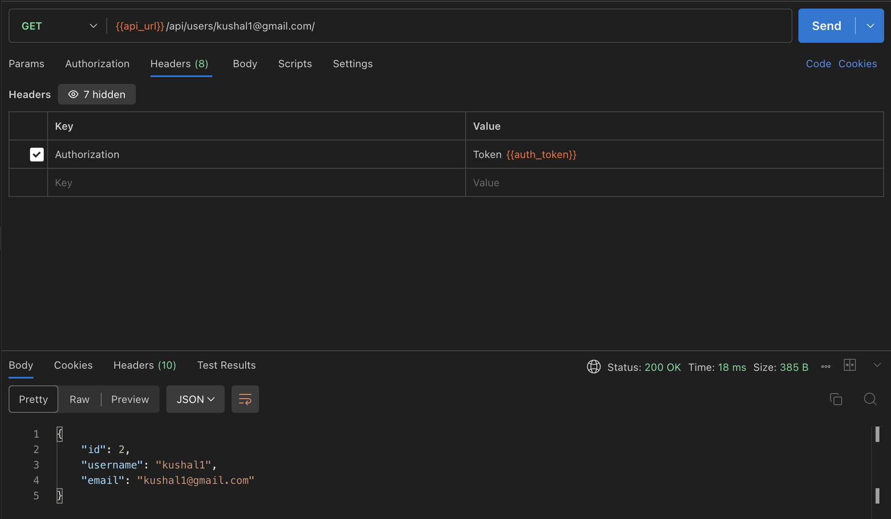
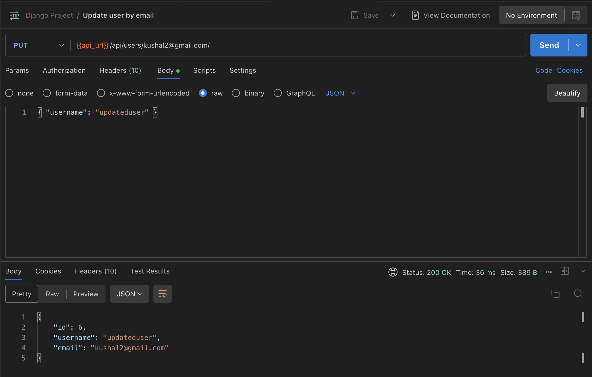
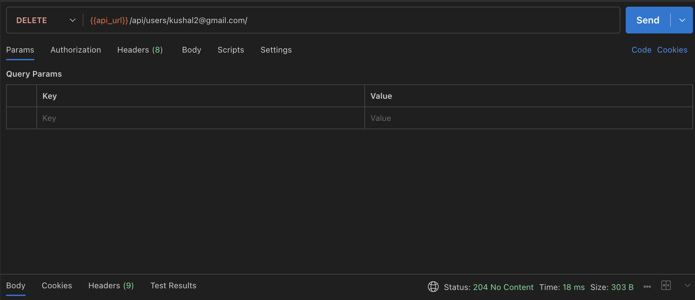

# Django Project

Django project created for practice.

## Installation

Create a virtual environment (MAC/Linux):

```bash
python3 -m venv DjangoAssignment
```

Activate the virtual environment:

```bash
source DjangoAssignment/bin/activate
```

Install requirements:

```bash
pip install -r requirements.txt
```

## Run
Navigate to LoginSystem directory : `cd LoginSystem`

Start server:
```bash
python manage.py runserver
```

## Superuser

Log in with:

Username: `kushalghimire`

Pasword: `123456`

## Available end points

Available end points can be viewed via postman. Import `Django Project.postman_collection.json` file located inside Postman directory. Set enviornment variable `api_url` to local url; defaults to `http://localhost:8000`

Set environment variable `auth_token` as the value returned when logged in as superuser in the end point `{{api_url}}/api/token/`

* **Loginify Home:**
    * **Method:** `GET`
    * **Endpoint:** `{{api_url}}/login/home`
    * **Description:** A simple test endpoint that returns a welcome message.

**Available endpoints as Rest APIs:**

**Authentication:** All endpoints, except for `/api/token/`, require Token Authentication. You must include an `Authorization` header with the value `Token <your_auth_token>`. Only works for user with atleast staff priviliges.

* **Obtain Auth Token**
    * **Method:** `POST`
    * **Endpoint:** `{{api_url}}/api/token/`
    * **Description:** Authenticates a user and returns their auth token.
    * **Body (raw/json):**
        ```json
        {
            "username": "superuser_username",
            "password": "superuser_password"
        }
        ```
    * **Example Request:**
      

* **List All Users**
    * **Method:** `GET`
    * **Endpoint:** `{{api_url}}/api/users/`
    * **Description:** Retrieves a list of all registered users. Requires token authentication.
    * **Example Request:**
    

* **Create New User**
    * **Method:** `POST`
    * **Endpoint:** `{{api_url}}/api/users/`
    * **Description:** Creates a new user in the system. Requires token authentication.
    * **Body (raw/json):**
        ```json
        {
            "username": "newuser",
            "email": "new@example.com",
            "password": "strongpassword123"
        }
        ```
    * **Example Request:**
    

* **Get User Details by Email**
    * **Method:** `GET`
    * **Endpoint:** `{{api_url}}/api/users/{user_email}/`
    * **Description:** Retrieves the details of a specific user by their email. Requires token authentication.
    * **Example Request:**
    

* **Update User Details**
    * **Method:** `PUT` / `PATCH`
    * **Endpoint:** `{{api_url}}/api/users/{user_email}/`
    * **Description:** Updates one or more details for a specific user. Requires token authentication.
    * **Body (raw/json):**
        ```json
        {
            "username": "new_username"
        }
        ```
    * **Example Request:**
    

* **Delete User**
    * **Method:** `DELETE`
    * **Endpoint:** `{{api_url}}/api/users/{user_email}/`
    * **Description:** Deletes a specific user from the system. Requires token authentication.
    * **Example Request:**
    


## Available pages
**`{{api_url}}/signup`**:

Accepts username, email and password. Email must be unique. Cannot be accessed via postman due to CSRF block.

**`{{api_url}}/login`**:

Accepts email and password to login.

